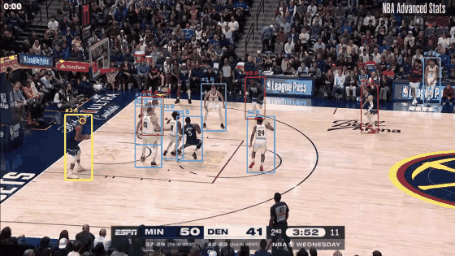

# CourtVision

**Basketball video in. Named play-by-play out.**

A nine-stage computer-vision pipeline that watches NBA broadcast footage and
produces timestamped, named, natural-language commentary — detection, tracking,
team assignment, possession, action recognition, and narration, end to end.

**[Live demo → pranitmathur06.github.io/CourtVision](https://pranitmathur06.github.io/CourtVision/)**



Boxes are coloured by team and numbered by track. The **yellow box is whoever has
the ball** — inferred from the footage, not read off a scoreboard feed.

```json
{ "time_s": 4.08, "action": "steal",   "team": "A", "player_name": "Conley" }
{ "time_s": 5.68, "action": "rebound", "team": "A", "player_name": "Randle" }
{ "time_s": 7.28, "action": "pass",    "team": "B", "player_name": "Jokić" }
```

```bash
python -m scripts.run_pipeline clip.mp4 --out outputs/run
```

---

## At a glance

| | |
|---|---|
| **Stack** | PyTorch · YOLO11 · VideoMAE · OpenCV · scikit-learn · LangGraph · CUDA C++ |
| **Scale** | ~4,500 lines of library code, 1,225 tests, 11 validation gates, 494 commits |
| **Throughput** | 84 minutes of video in 47.7 minutes — **1.76× real time** on one RTX 4090 |
| **Action recognition** | **0.816** across 7 classes on 735 held-out clips (chance 0.143) |
| **Possession** | **59.2%** on 157 held-out frames a person labelled (CI 51–67%) |
| **Player naming** | Real names, no jersey OCR — joined against the official NBA play-by-play |

---

## What it does

**Nine stages:** extract → detect → track → team assignment → possession → action
classification → event structuring → commentary → render.

**Action classification** — 735 held-out clips, seven classes:

| | | | |
|---|---|---|---|
| dribble | 0.90 | block | 0.86 |
| shot | 0.84 | steal | 0.82 |
| other | 0.81 | pass | 0.79 |
| rebound | 0.78 | **overall** | **0.816** |

Every class lands between 0.76 and 0.90 against a uniform chance of 0.143.

## Which numbers come from vision, and which come from the feed

This is the most important thing to know about the accuracy above, and it was
not stated anywhere until now.

**The event text comes from the official NBA play-by-play, not from vision.**
What vision does is put that record onto the video — reading the game clock off
the scoreboard and aligning it — and draw boxes over the footage. So:

| | |
|---|---|
| Timestamping a known event onto the video | **99.5 / 97.3 / 96.6 / 92.2%** over four full games |
| Published clips landing within 1 s of the event | **93–99%** over 1,195 clips |
| Deciding *what happened* from pixels alone | shots F1 **0.65** inside the 27–48% of video where the clock reads, **0.45–0.50** without that filter |
| Deciding *who* has the ball from pixels alone | **50–66%** per game on uniformly sampled frames |
| Finding the ball: reported / proposed at any rank | **65–83% / 82–96%** per game |
| Deciding which of the two kits a player wears | **94–98%** over four games, scored with no labels at all |
| Deciding whether a rebound was offensive or defensive | **39–51%**, against a 72% majority class — worse than saying "defensive" every time |
| Deciding whether a basket was assisted | **44–56%**, against a 54–60% majority class |
| Never drawing more than thirteen people on the court | **57–94%** per game |
| Naming a player from his jersey | **45%** |

The three-line block in the middle of that table is new and is the honest
answer to "can vision read the game". Assists and rebounds had a published
number before this — 91% for assists — and **it was never measured on a
broadcast**: `check_assists.py` and `check_rebounds.py` read SportVU tracking
coordinates, where every player is located to the inch and identities are
stable all game. They measure the event logic on perfect inputs. Measured on
pixels, both are at or below their own majority class, and the cause is
upstream: rebounds and assists inherit ball-handler attribution (66%), which
inherits ball selection (80% against a 96% ceiling).

The first of those four games is one **nothing in this repository was tuned on**:
a 2026 regular-season broadcast in a third arena, at 1080p60, with a scorebug
neither Finals encode has. `scripts/add_broadcast.py --game hou` took it from a
video file and an official game id to a scored, timestamped, clipped broadcast
with **no edited constant** -- the clock reader located a scorebug it had never
seen, learned its digits and read all four periods with nothing configured --
and its alignment is the best of the four. That is the claim "a new broadcast
fits right in", measured rather than asserted.

The fourth number moved this week too: Game 7 went from 88.8% to 92.2% when the
clock reader stopped being blind to the last ten seconds of every period, which
is where 39% of all four games' unaligned events turned out to be.

The demo reads well because the first two rows are strong. The rest are the
honest state of vision-only understanding, and the project does not claim
otherwise. They are quoted PER GAME and on UNIFORMLY SAMPLED frames: an earlier
version of this table pooled those with a second set drawn because the model was
already failing on them, which moved every one of them 13 to 30 points. An earlier version of this table said possession was "9/9 on a
human-annotated answer key" — that was the v1 spec's sanity gate on ten
hand-picked moments, and the properly-powered number on 157 uniformly-sampled
held-out frames is fifty points lower.

**Players get real names without solving jersey OCR.** Jersey-number recognition
is a hard open research problem — small text, motion blur, occlusion. But you
don't have to *recognise* a player to *name* one. Basketball already publishes an
authoritative timestamped event stream. Read the game clock off the scoreboard
(large, high-contrast digits — far easier than a jersey), look up what the
official play-by-play says happened at that moment, and naming becomes a **join,
not a recognition problem**.

**The commentary cannot fabricate.** The language model narrates events already
computed upstream; it never decides anything. A validator checks both directions —
a real name where the event has none is an error, and a *different* name than the
event's is an error. An unrecognised capitalised word is assumed to be a name and
flagged, because a false flag costs one retry while a missed fabrication puts a
false claim about a real person into the output.

---

## The part I'd actually want to talk about

The interesting work here wasn't modelling. It was **measurement** — repeatedly
finding that a good-looking number was measuring the wrong thing.

**The 0.810 accuracy was partly reading the dataset, not the action.** SpaceJam
and BARD clips are visually distinguishable, and every rebound and steal clip came
from one corpus while every other class came from the other — so corpus membership
predicted the label for 660 of 2,660 clips. Augmentation doesn't fix that, and
measurably didn't: image statistics still separated the corpora 95% of the time
after jitter. The fix was rebalancing composition until corpus membership was
worth **+0.010** of accuracy instead of +0.150. The same action now scores within
0.06 whichever corpus it came from.

**I kept the model that scored lower.** One run hit 0.822 overall and 0.84 on
rebound — and reopened the confound to +0.099, because rebound had become the
dominant class in one corpus. 0.816 with the confound closed is worth more than
0.822 with it open.

**A class "regressed" from 0.90 to 0.67 and the model was fine.** The validation
split shuffled globally after concatenating classes in order, so it depended on
each class's *size*. Changing one class from 226 clips to 223 reshuffled three
others — only 15 of 79 clips in that class's validation set survived between runs.
For two runs, every cross-run comparison in the project was partly comparing
different clips.

**Profiling overturned the obvious optimisation target.** Action classification
was 76.8% of runtime and detection only 14.6% — but profiling *without* the
classifier showed detection at 92%, which would have aimed every hour of CUDA work
at the wrong stage. Batching the classifier's windows took stage 6 from 76.8% to
**35.8% with no CUDA at all**. The hand-written kernel then went to team
assignment, the largest stage with no vendor-tuned implementation behind it.

**Two GPU experiments that returned "no".** The custom CUDA kernel compiles and
matches an OpenCV oracle to 0.1456 against a 2.0 tolerance — but the 1.4× speedup
reproduced on one box and not another with the same GPU and CPU, so it was a
property of the machine and shouldn't be quoted. And the dual-GPU stage split
works correctly and is *marginally slower*: the wait times show the classifier
never starves, so the two stages were never contending. Both results cost a few
dollars of rented GPU time and each prevented an optimisation track built on a
false premise.

---

## What it does not do yet

**It has been validated on clips, not on games.** Running 84 minutes of continuous
footage — 50,304 frames, 570× the reference clip — surfaced the real gap:

| action | emitted/min | realistic/min | |
|---|---|---|---|
| rebound | 26.9 | 1.8 | **15× too many** |
| steal | 3.4 | 0.3 | 11× too many |
| pass | 0.2 | 9.6 | **48× too few** |

The classifier was trained on clips that were *cut to contain an action*. A real
game is mostly ordinary play. The model has never seen that prior, so it forces
every window into an action class and rebound absorbs the slack. It isn't
uncertain, either — 60 random game windows came back 47 rebound at a mean
confidence of 0.955, so a confidence floor can't fix it. A `background` class,
sampled from the quiet stretches of real broadcast footage, is built and awaiting
a retrain.

Two more structural findings from the same run: 268 broadcast cuts fragmented
tracking into **8,602 track IDs** (19 on a short clip), which defeats event
de-duplication; and the annotated output is 4.8 GB for 84 minutes.

**The pipeline itself scaled cleanly** — 1.76× real time, memory flat in clip
length. The honest claim is narrower and better evidenced than it was: the
pipeline runs on game-length video, and the action model is not yet usable on it.

---

## Where things stand

| | |
|---|---|
| v1 — pipeline | done, 11 gates, 346 tests |
| v2 — CUDA kernel | compiles, matches an OpenCV oracle; speedup does not reproduce across machines |
| v2 — dual-GPU split | verified, and measurably *not* worth it — the classifier was never the bottleneck |
| v3 — player naming | working end to end against the official feed |
| v3 — play recognition | geometric sets only (pick-and-roll, horns, DHO); coaching set *calls* are a real data gap |
| tracking ceiling | 10 full games scored from coordinates — shot and rebound hold, steal is marginal, block is not emitted |

---

## The ceiling, from tracking data

Ten full NBA games of 25 Hz player coordinates, scored against official
play-by-play, asking a question video cannot answer: **is the event logic right
when perception is perfect?**

| action | median | precision | recall | |
|---|---|---|---|---|
| shot | 0.78× | 0.89 | 0.71 | solved |
| rebound | 1.20× | 0.51 | 0.59 | sound |
| steal | 1.71× | 0.24 | 0.35 | marginal |
| block | — | — | — | not emitted |

Read precision, not the ratio. Steal's *count* fits while 0.24 precision means
three of four are the wrong moment — and perfect perception did not fix it. That
makes steal an **event-logic** problem rather than a perception one, which no
amount of model training would have surfaced.

It also settled the direction of the whole project: measured separability against
ordinary play is +0.042 for rebound from a player crop, +0.054 for steal, and
**−0.170 for block — below chance**. These are possession and trajectory events,
not visual categories. Deriving steal from possession instead of classifying it
took it from 33.8× over-reporting to 1.73×.

---

## Read more

**→ [Technical report](docs/technical-report.md)** — the full engineering account:
architecture, every design decision with its measurement, what was tried and
rejected, and where it breaks.

[Continuous-game accuracy](docs/continuous-game-accuracy.md) ·
[Full-game findings](docs/full-game-findings.md) ·
[Model results](docs/v7-gpu-results.md) ·
[Possession investigation](docs/possession-investigation.md) ·
[GPU runbook](docs/v2-gpu-runbook.md) ·
[v1 spec](docs/spec-v1.md)

---

## Attribution

Clips and annotations from the **BARD** dataset (Gabriele Giudici, 2025, CC BY
4.0) and **SpaceJam**; detector training data from **basketball-player-detection-3**
on Roboflow Universe (CC BY 4.0). Official play-by-play via `stats.nba.com`. Tracking figures use the public
2015–16 SportVU release for research only; neither it nor broadcast footage is
redistributed here.
